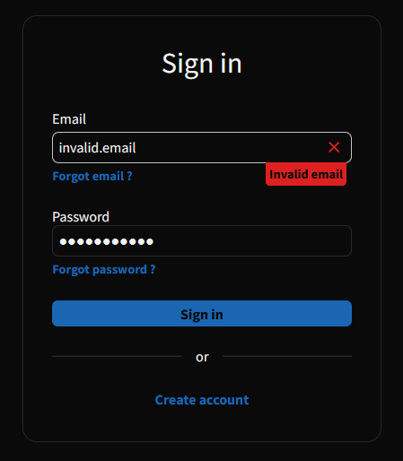

# A perfect login page

At the time of making this, I had recently read an article about forms and accessibility.
I wanted to create a simple, accessible form just for training.

## Overview



## Inspect

If you want to inspect this project on your computer, please do the following:

```bash
# Clone the repo
gh repo clone MartinHeywang/perfect-login-page

# Serve it on localhost
# optional: npm install --global serve
serve -s perfect-login-page
```
